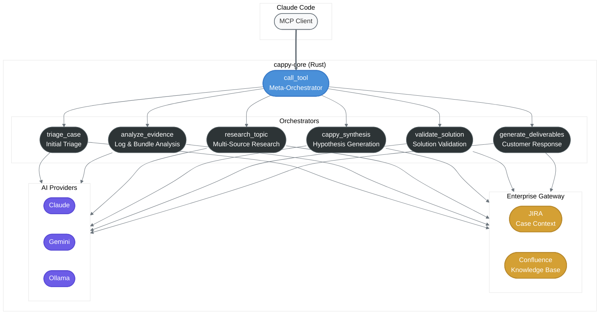

# CAPPY

**Cortex AI-Powered Pattern Analysis Toolkit**

CAPPY is a Rust-based MCP server built for AI-assisted technical investigations on Palo Alto Networks Cortex products (XSOAR, XSIAM, XDR). It provides 7 orchestrators through a single MCP entry point, integrates with enterprise ticketing systems, and routes AI workloads across multiple providers.

## What It Does

CAPPY accelerates TAC (Technical Assistance Center) investigations by combining structured analysis workflows with AI-powered synthesis. Instead of manually searching knowledge bases, parsing log bundles, and cross-referencing JIRA — CAPPY orchestrates these steps through Claude Code with pattern matching against 400+ known issue signatures.

### Key Capabilities

- **7 MCP orchestrators** — triage, evidence analysis, research, synthesis, validation, deliverable generation, and meta-orchestration
- **Pattern database** — 400+ patterns across XSOAR, XSIAM, and XDR with confidence levels (Definitive, Strong, Moderate)
- **Enterprise gateway** — JIRA and Confluence integration for case context and knowledge retrieval
- **Multi-provider AI routing** — Claude, Gemini, and Ollama with tiered fallback
- **8-phase investigation workflow** — Structured `/investigate` skill with phase gates and validation rules

### Architecture



### Investigation Workflow

```mermaid
%%{init: {'theme': 'base', 'themeVariables': {'primaryColor': '#ffffff', 'lineColor': '#6c757d'}}}%%
flowchart LR
    subgraph TRIAGE ["Phase 0-1"]
        P0(["Initialize<br/>Case Setup"]) --> P1(["Triage<br/>Pattern Match"])
    end

    P1 ==> P2

    subgraph ANALYSIS ["Phase 2-3"]
        P2(["Evidence<br/>Log Analysis"]) --> P3(["Research<br/>Multi-Source"])
    end

    P3 ==> P4

    subgraph SYNTHESIS ["Phase 4-5"]
        P4(["Synthesis<br/>Hypothesis"]) --> P5(["Validate<br/>Solution Design"])
        P5 -.->|"hypothesis rejected"| P4
    end

    P5 ==> PG

    subgraph DELIVER ["Phase 6-7"]
        PG{"Quality<br/>Gate"} ==> P6(["Deliverables<br/>Customer Response"])
        PG -.->|"fail"| P4
        P6 --> P7(["Close<br/>JIRA Update"])
    end

    classDef triage fill:#4a90d9,color:#fff,stroke:#3a7bc8,stroke-width:2px
    classDef analysis fill:#00b894,color:#fff,stroke:#009a7d,stroke-width:2px
    classDef synth fill:#6c5ce7,color:#fff,stroke:#5a4bd6,stroke-width:2px
    classDef deliver fill:#d4a034,color:#fff,stroke:#b8892d,stroke-width:2px
    classDef gate fill:#2d3436,color:#fff,stroke:#636e72,stroke-width:2px

    class P0,P1 triage
    class P2,P3 analysis
    class P4,P5 synth
    class P6,P7 deliver
    class PG gate
```



Each phase has validation sub-skills that enforce quality gates — hypothesis coherence checks, evidence completeness thresholds, and escalation decision trees.

## Plugin Structure

```
plugin/
├── .mcp.json                    # MCP server definition
├── agents/
│   └── cappy.md                 # CAPPY assistant definition
└── skills/
    └── investigate/
        ├── SKILL.md             # 8-phase investigation workflow
        └── sub-skills/          # 9 validation rule files
            ├── curator.md       # Claim registration rules
            ├── gate.md          # Phase gate thresholds
            ├── sherlock.md      # Hypothesis coherence
            ├── recon.md         # Environment validation
            ├── synthesis.md     # Narrative generation
            ├── validate.md      # Solution validation
            ├── escalation.md    # Escalation decision trees
            ├── initialize.md    # Phase 0 setup
            └── logging.md       # Forensics logging
```

## Tech Stack

- **Runtime**: Rust (single binary, ~6MB)
- **Protocol**: MCP over stdio (JSON-RPC 2.0)
- **AI Providers**: Claude, Gemini, Ollama
- **Integrations**: JIRA, Confluence (via MCP gateway)
- **Patterns**: 400+ signatures across Cortex products
- **Standards**: clippy::pedantic, zero unwrap/panic

## Related

CAPPY was the original investigation toolkit that led to the creation of the broader Light Architects platform:

| Server | Purpose |
|--------|---------|
| **CAPPY** | Cortex investigation automation |
| [QUANTUM](https://github.com/theLightArchitect/QUANTUM) | Product-agnostic forensic investigation |
| [CORSO](https://github.com/theLightArchitect/CORSO) | Security, orchestration, build pipeline |
| [EVA](https://github.com/theLightArchitect/EVA) | Personal assistant, memory, code review |
| [SOUL](https://github.com/theLightArchitect/SOUL) | Knowledge graph, shared infrastructure, voice |

## Author

Kevin Francis Tan — [github.com/theLightArchitect](https://github.com/theLightArchitect)
