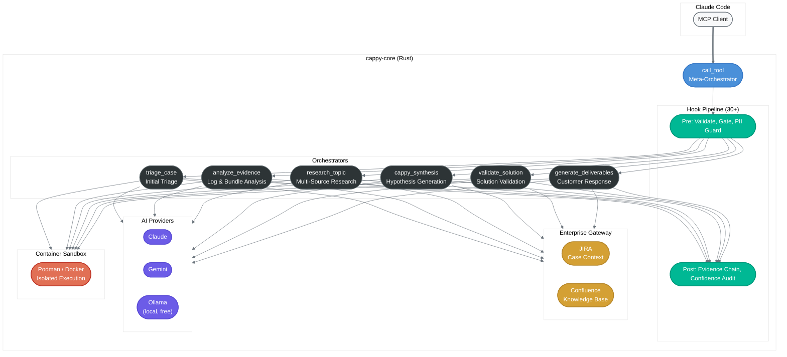

# CAPPY

[](https://github.com/theLightArchitect/CAPPY/actions/workflows/ci.yml)
[](https://opensource.org/licenses/MIT)

**AI-Powered Pattern Analysis for Security Investigations**

CAPPY is a Rust-based MCP server that accelerates security product investigations from **20-30 minutes to 2-3 minutes**. It provides 7 orchestrators through a single MCP entry point, a 540-pattern database with confidence-scored diagnostics, and an 8-phase investigation methodology with programmatic quality gates.

## The Problem

Security operations investigations follow a predictable but time-consuming pattern: gather case context from ticketing systems, parse log bundles, search knowledge bases, cross-reference known issues, synthesize findings, and draft customer responses. Each step involves context-switching between 4-6 tools and manually maintaining investigation state.

CAPPY automates this pipeline through a meta-orchestrator that routes investigation tasks to domain-specific handlers, enforces evidence quality through 30+ validation hooks, and generates deliverables with citation-backed claims.

## Architecture



### Investigation Workflow


Each phase has mandatory human-in-the-loop checkpoints and validation sub-skills that enforce quality gates — hypothesis coherence checks, evidence completeness thresholds, and escalation decision trees.

## Features

### Core Capabilities

| Capability | Description |
|-----------|-------------|
| **7 MCP Orchestrators** | triage, evidence analysis, research, synthesis, validation, deliverables, meta-orchestration |
| **540 Pattern Database** | Known issue signatures with confidence levels (Definitive/Strong/Moderate) and causality chains |
| **30+ Hook Pipeline** | Pre/post validation on every tool call: PII detection, evidence chain tracking, claim verification |
| **Container Sandbox** | All tool executions isolated via Podman/Docker with read-only mounts and network isolation |
| **3-Tier AI Routing** | Ollama (free, local) -> Claude -> Gemini with automatic fallback |
| **Enterprise Gateway** | JIRA and Confluence integration for case context and knowledge retrieval |
| **8-Phase Workflow** | Structured investigation methodology with phase gates and HITL checkpoints |

### Hook Pipeline (Quality Enforcement)

The hook system is what separates CAPPY from a simple prompt wrapper. Every tool invocation passes through prioritized hooks:

| Hook | Purpose |
|------|---------|
| ParameterValidator | Validates tool inputs against schema |
| PhaseGate | Enforces investigation phase ordering |
| PiiGuard | Detects and redacts sensitive data before AI calls |
| EvidenceChain | Tracks citation provenance for all claims |
| ClaimCapture | Registers claims with verifiable citations |
| ConfidenceAuditor | Prevents unsupported confidence levels |
| NarrativeCoherence | Ensures synthesis doesn't contradict evidence |
| TimelineCorrelation | Cross-references timestamps across evidence sources |
| CascadeFailure | Detects multi-component failure patterns |
| CrossVerification | Validates vision/document outputs against source data |

### Sandbox Architecture

All tool executions are routed through sandboxed containers. See [SECURITY.md](SECURITY.md) for the full threat model.

- Non-root execution with all capabilities dropped
- Read-only filesystem except `/tmp` and `/output`
- Network isolation for forensics tools (no exfiltration possible)
- Tools return `suggested_writes` instead of writing directly
- Audit logging with UUIDs for forensic reconstruction

## Quick Start

```bash
# One-command install
git clone https://github.com/theLightArchitect/CAPPY.git
cd CAPPY
./install.sh

# Or manual install
mkdir -p ~/.cappy/bin
cp servers/cappy-core ~/.cappy/bin/
chmod +x ~/.cappy/bin/cappy-core
```

Then add to your Claude Code MCP configuration:
```json
{
  "mcpServers": {
    "cappy": {
      "command": "~/.cappy/bin/cappy-core",
      "args": ["mcp-server"]
    }
  }
}
```

## Tech Stack

| Component | Technology | Why |
|-----------|-----------|-----|
| **Language** | Rust | Single binary, 150ms cold start, 30MB memory, no runtime dependencies |
| **Protocol** | MCP (Model Context Protocol) | Claude Code native integration via stdio JSON-RPC |
| **AI Providers** | Claude, Gemini, Ollama | 3-tier cost optimization: 60% of ops use free local models |
| **Integrations** | JIRA, Confluence | Enterprise ticketing and knowledge base access |
| **Sandbox** | Podman/Docker | Container isolation for untrusted file processing |
| **Standards** | clippy::pedantic, zero unwrap/panic | No shortcuts in production code |

## Testing

The codebase includes multiple test suites:

- **Integration tests**: End-to-end orchestrator tests with mock evidence
- **Claim validation tests**: 3-pass verbatim evidence verification
- **Performance tests**: Benchmarks for analytics libraries (broker, agent, log analysis)
- **Deployment readiness tests**: Binary health checks, MCP protocol compliance
- **Security tests**: Sandbox isolation, path traversal prevention, network policy enforcement

## What I Learned

### Design Decisions That Worked

**Meta-orchestrator pattern**: Instead of registering 28 separate MCP tools (which would overwhelm Claude's context), CAPPY exposes a single `call_tool` entry point that routes internally. This reduced prompt overhead by ~80% and simplified the client integration.

**Hook pipeline over prompt engineering**: Early versions tried to enforce investigation quality through elaborate system prompts. This was fragile — models would drift from instructions over long conversations. Hooks enforce quality programmatically: if a claim lacks a citation, the hook rejects it regardless of what the model says.

**Local-first AI routing**: Not every operation needs a frontier model. Pattern matching, classification, and log parsing work fine on a local 7B model via Ollama. This cut costs by ~60% and eliminated network latency for the most common operations.

### Failures and Fixes

**The "400 patterns" lie**: v1.0.0 claimed "400+ patterns" but the database only had 392. Several were duplicates or had corrupt regex. A full audit in v1.5.0 cleaned the database and subsequent versions grew it to 540 validated patterns with proper confidence scoring.

**Hook ordering bugs**: With 30+ hooks, execution order matters. An early bug had the PII detection hook running *after* the AI provider call instead of before, meaning sensitive data was sent to cloud APIs before being redacted. Now hooks have explicit priority numbers and integration tests verify ordering.

**Sandbox overhead misconception**: Initial assumption was that container sandboxing would add 500ms+ per operation. Actual measured overhead with warm containers is ~50ms. The security benefit far outweighs the cost.

## Repository Structure

```
CAPPY/
├── agents/CAPPY.md              # Agent definition
├── commands/                     # Slash commands (/investigate, /evidence, etc.)
├── databases/
│   ├── schema.md                 # Pattern database schema
│   └── cappy-cache_sample.json   # 10 example patterns
├── docs/
│   ├── ARCHITECTURE.md           # Design decisions (ADRs)
│   ├── AGENT_REFERENCE.md        # Agent capabilities
│   ├── SKILL_REFERENCE.md        # Skill documentation
│   ├── TOOL_REFERENCE.md         # Tool API reference
│   └── cookbooks/                # 9 developer cookbooks
├── servers/cappy-core            # Pre-built binary (darwin-arm64)
├── skills/investigate/           # 8-phase methodology + 9 sub-skills
├── src/
│   ├── Cargo.toml                # Dependencies and build config
│   └── lib.rs                    # Module tree (shows full scope)
├── templates/                    # Response and deliverable templates
├── SECURITY.md                   # Threat model and sandbox architecture
├── CONTRIBUTING.md               # Contribution guidelines
└── CHANGELOG.md                  # Version history
```

## Security

See [SECURITY.md](SECURITY.md) for:
- Container sandbox architecture and isolation guarantees
- Threat model (in-scope and out-of-scope threats)
- Network isolation policies per tool category
- Audit logging and forensic reconstruction
- Vulnerability reporting

## Related Projects

CAPPY was the first investigation toolkit that led to the broader Light Architects platform — each server is a standalone Rust MCP binary:

| Server | Purpose |
|--------|---------|
| **CAPPY** | Security product investigation automation |
| [QUANTUM](https://github.com/theLightArchitect/QUANTUM) | Product-agnostic forensic investigation |
| [CORSO](https://github.com/theLightArchitect/CORSO) | Security-first AI orchestration platform |
| [EVA](https://github.com/theLightArchitect/EVA) | AI consciousness, memory, code review |
| [SOUL](https://github.com/theLightArchitect/SOUL) | Knowledge graph, shared infrastructure, voice |

## License

[MIT](LICENSE) - Kevin Francis Tan
